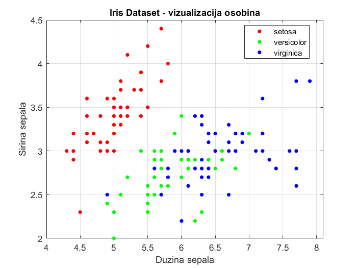
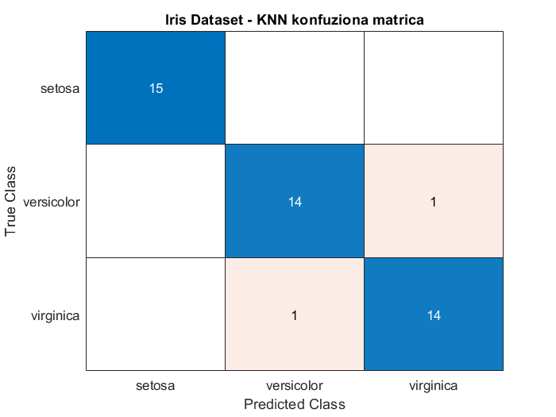
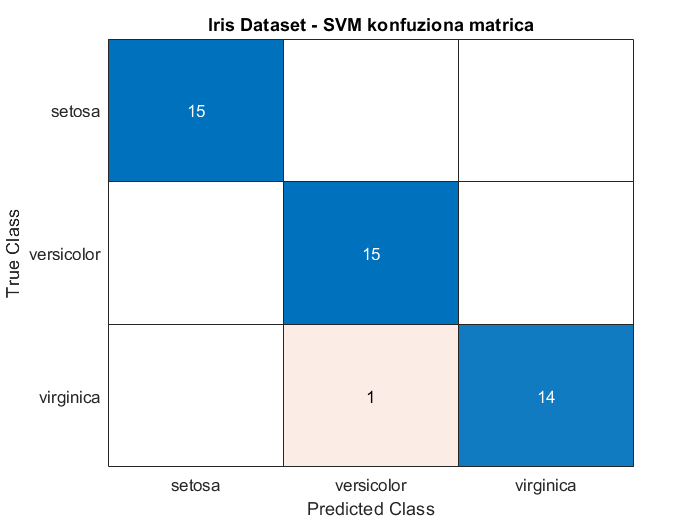
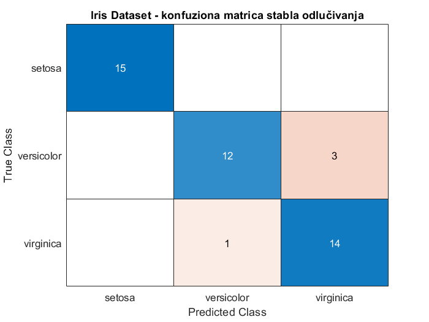
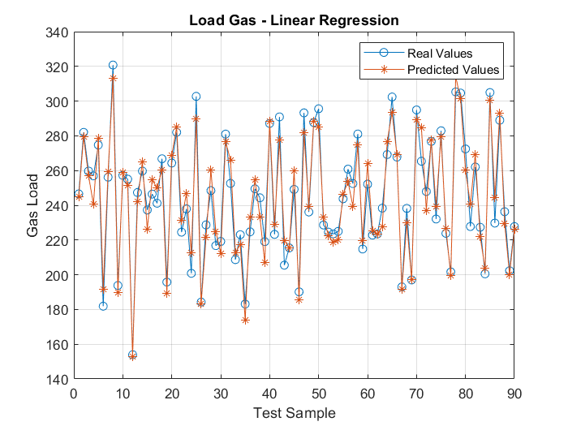
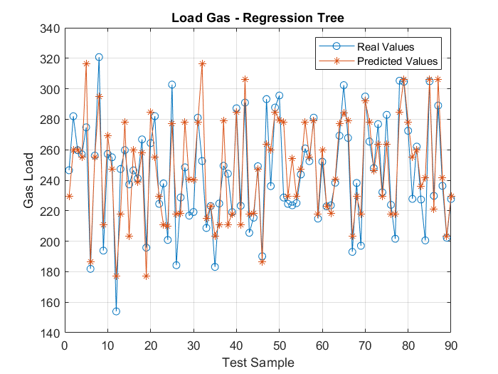
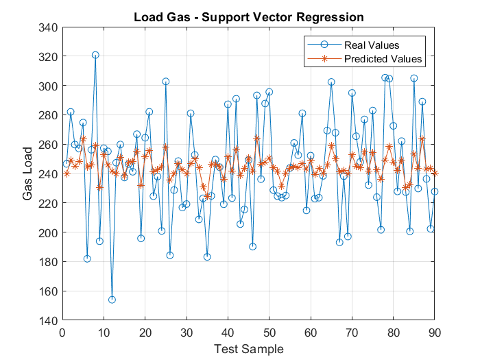
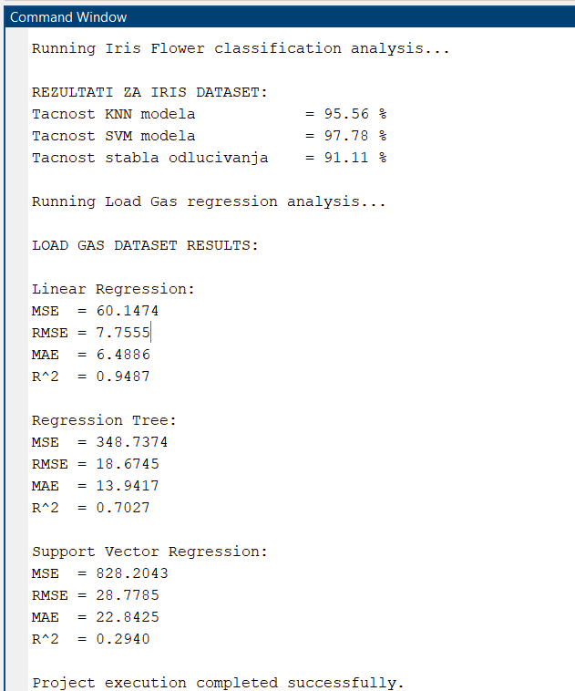

# Implementacija i analiza algoritama superviziranog učenja na Loadgas i Iris Flower dataset-u

Ovaj projekat prikazuje implementaciju i analizu algoritama superviziranog učenja u MATLAB okruženju na dva različita problema:

- **Iris Flower dataset** – klasifikacioni problem
- **Loadgas dataset** – regresioni problem

Cilj projekta je pokazati razliku između klasifikacije i regresije, kao i način na koji se različiti modeli treniraju, testiraju i evaluiraju u MATLAB-u.

## Korišteni algoritmi

### Iris Flower dataset
Za klasifikaciju su korišteni sljedeći modeli:
- **K-Nearest Neighbors (KNN)**
- **Support Vector Machine (SVM)**
- **Decision Tree**

### Loadgas dataset
Za regresiju su korišteni sljedeći modeli:
- **Linear Regression**
- **Regression Tree**
- **Support Vector Regression (SVR)**

## Sadržaj repozitorija

Repozitorij sadrži sljedeće glavne fajlove: `main.m`, `iris_classification.m`, `loadgas_regression.m`, `computeRegressionMetrics.m`, `generate_dateset.m` i `loadgas.csv`. :contentReference[oaicite:1]{index=1}

Kratak opis:
- **main.m** – glavni fajl za pokretanje kompletnog projekta
- **iris_classification.m** – implementacija klasifikacije nad Iris datasetom
- **loadgas_regression.m** – implementacija regresije nad Loadgas datasetom
- **computeRegressionMetrics.m** – funkcija za računanje regresionih metrika
- **generate_dateset.m** – skripta za generisanje sintetičkog Loadgas dataseta
- **loadgas.csv** – spremljeni dataset za regresioni dio projekta

## Zahtjevi

Za pokretanje projekta potrebno je imati:
- **MATLAB** (preporučeno R2021a ili noviji)
- Statistics and Machine Learning Toolbox

## Kako pokrenuti projekat

### Kloniranje repozitorija

U Git Command Window-u ili terminalu potrebno je pokrenuti:

```bash
git clone <URL_REPOZITORIJA>
```

# Rezultati i analiza

## Poređenje datasetova

| Dataset   | Tip problema   | Cilj                               |
|----------|---------------|------------------------------------|
| Iris     | Klasifikacija | Predviđanje diskretne klase        |
| Load Gas | Regresija     | Predviđanje kontinuirane vrijednosti |

Kod klasifikacionog problema cilj je dodijeliti uzorke odgovarajućim klasama, dok se kod regresije predviđaju numeričke vrijednosti. Ova razlika direktno utiče na izbor modela i metrika evaluacije.

---

## 1. Iris dataset – klasifikacija

### Vizualizacija podataka

Na narednoj slici prikazana je distribucija podataka po klasama (setosa, versicolor, virginica) u prostoru odabranih osobina.



Može se uočiti da je klasa setosa jasno separabilna u odnosu na preostale dvije klase, dok između klasa versicolor i virginica postoji određeni stepen preklapanja. Ova karakteristika direktno utiče na performanse klasifikacionih modela, budući da se većina grešaka javlja upravo između ove dvije klase.

---

### Konfuzione matrice

#### KNN



KNN model postiže tačnost od 95.56%. Uočene su dvije pogrešne klasifikacije koje se odnose na zamjenu između klasa versicolor i virginica.

#### SVM



SVM model ostvaruje najbolji rezultat sa tačnošću od 97.78%. Prisutan je samo jedan pogrešno klasifikovan uzorak, što ukazuje na vrlo dobru sposobnost generalizacije modela.

#### Decision Tree



Model stabla odlučivanja postiže tačnost od 91.11%. U odnosu na ostale modele, prisutan je veći broj grešaka, naročito kod klase versicolor.

---

### Objašnjenje konfuzione matrice

Konfuziona matrica predstavlja pregled tačnih i netačnih klasifikacija. Elementi na glavnoj dijagonali odgovaraju ispravno klasifikovanim uzorcima, dok elementi van dijagonale predstavljaju greške modela. Dominantna dijagonala ukazuje na dobar model, što je najizraženije kod SVM pristupa.

---

## 2. Load Gas dataset – regresija

### Linear Regression



Linearna regresija pokazuje najbolje performanse sa vrijednostima MSE = 60.1474, RMSE = 7.7555, MAE = 6.4886 i koeficijentom determinacije R² = 0.9487. Dobijeni rezultati ukazuju na vrlo dobro slaganje predikcija sa stvarnim vrijednostima.

### Regression Tree



Regresiono stablo ostvaruje slabije rezultate u odnosu na linearnu regresiju, sa vrijednostima MSE = 348.7374, RMSE = 18.6745, MAE = 13.9417 i R² = 0.7027. Primjetne su oscilacije u predikcijama, što ukazuje na manju stabilnost modela.

### Support Vector Regression (SVR)



SVR model postiže najlošije rezultate sa MSE = 828.2043, RMSE = 28.7785, MAE = 22.8425 i R² = 0.2940. Predikcije su značajno zaglađene i ne uspijevaju adekvatno pratiti varijacije u podacima.

---

### Objašnjenje grafova

Na prikazanim grafovima plava linija predstavlja stvarne vrijednosti, dok crvena linija označava predikcije modela. Što je veće preklapanje između ove dvije krive, to model postiže bolje performanse. Linearna regresija pokazuje najveći stepen poklapanja, dok su odstupanja kod ostalih modela izraženija.

---

## Zaključak

Analiza rezultata pokazuje da SVM model ostvaruje najbolje performanse u klasifikacionom zadatku, prvenstveno zbog sposobnosti da pronađe optimalnu granicu razdvajanja između klasa, čak i u slučaju njihovog preklapanja.

U regresionom zadatku najbolji rezultat postiže linearna regresija, što ukazuje na postojanje približno linearnog odnosa između ulaznih i izlaznih varijabli. Jednostavnija struktura modela u ovom slučaju omogućava stabilnije i preciznije predikcije.

S druge strane, stablo odlučivanja pokazuje slabije performanse zbog sklonosti ka preprilagođavanju podacima, dok SVR model ne uspijeva adekvatno modelirati varijacije u skupu podataka, što rezultira velikim odstupanjima.

Na osnovu dobijenih rezultata može se zaključiti da izbor modela treba biti usklađen sa prirodom problema i karakteristikama podataka. Jednostavni modeli mogu dati najbolje rezultate kada postoji jasan odnos između varijabli, dok složeniji modeli dolaze do izražaja u problemima sa kompleksnijom strukturom.

---

## Izlaz programa



Izlaz programa potvrđuje uspješnu implementaciju klasifikacionog i regresionog dijela, uključujući izračun evaluacionih metrika i generisanje odgovarajućih vizualizacija.
